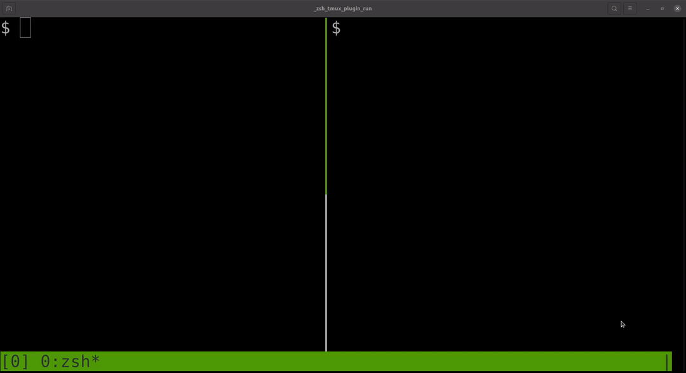

# tmux-pyenv
Simple TMUX plugin to keep track of you current global-local pyenvs.



## Installation

Add the plugin to your `~/.tmux.conf` file.
```bash
set -g @plugin 'Mystaras/tmux-pyenv.git'
```

Add the `#{pyenv_info}` format string to your status bar.
```bash
set -g status-right '#{pyenv_info}'
```

Finally, `prefix + I` to fetch the plugin and source it.

## Issues
If the output does not refresh to your liking, add to your `~/.tmux.conf` file.
```bash
set -g status-interval 1
```


